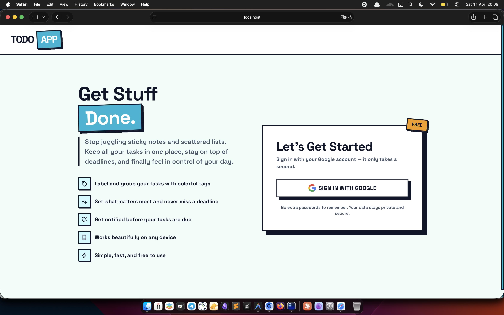
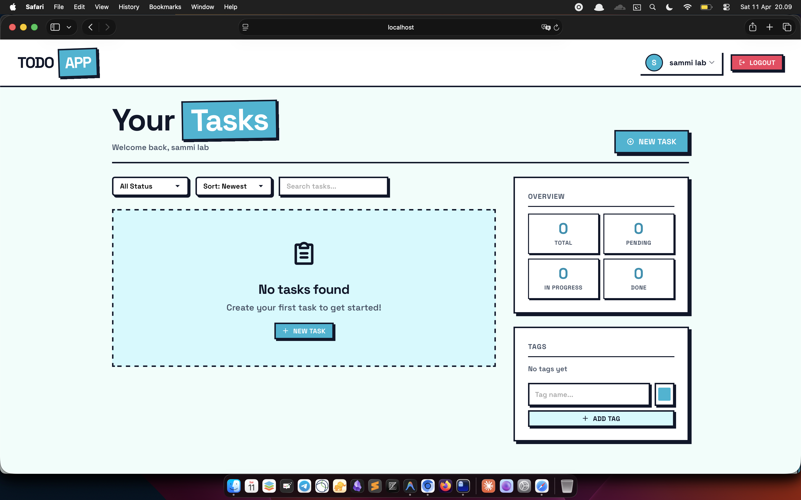
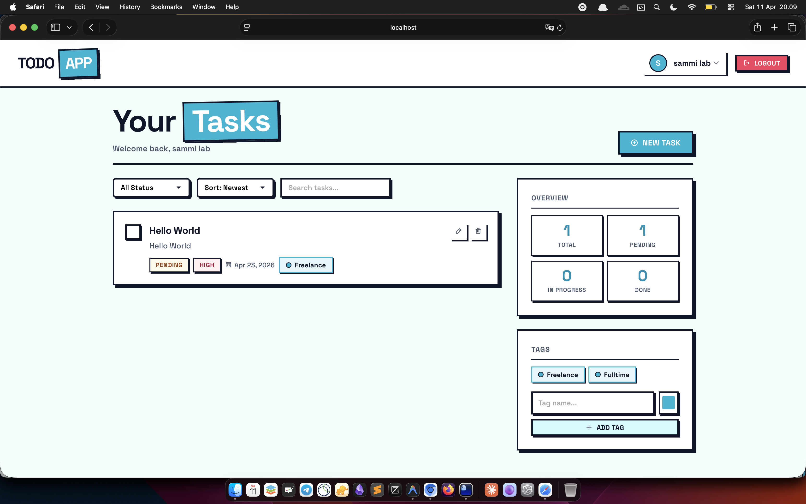

# Go Todo App

A production-grade task management system built entirely in Go using strict Hexagonal Architecture.

## Preview





## Key Technologies
- Core: Go 1.22+, strict Hexagonal Architecture.
- Interfaces: gRPC & HTTP (via grpc-gateway), Buf schema definitions.
- Data & Caching: PostgreSQL (pgx), Memcached, Redis (go-redis).
- Auth & Security: PASETO v2, Google OAuth2 integration.
- Background Jobs: Asynchronous resilient queues via asynq.
- Infrastructure: Docker, Docker Compose, optimized multi-stage Distroless containers.
- Observability: Wide-event structured logging (slog).

## System Architecture

The application is heavily decoupled into three highly-optimized discrete runtime binaries deployed independently via Docker Compose:

1. server: The primary gRPC & HTTP REST boundary. Handles User flows, Auth, and immediate Todo mutations.
2. scheduler: A lightweight SQL poller. Identifies upcoming deadlines (e.g., Todos due in <24 hours) and instantly routes queue payloads to Redis.
3. worker: The Asynq driving adapter. A background processor handling heavy tasks safely (e.g., bouncing SMTP requests using Mailpit, sending HTML email with exponential backoff).

## Quick Start

Everything operates smoothly inside Docker. No local dependencies required except Docker and make.

```bash
# 1. Clone the repository
git clone https://github.com/SemmiDev/go-todo-app.git
cd go-todo-app

# 2. Set up your environment variables
# Note: You MUST update .env with your own Google OAuth client credentials for login to work!
cp .env.example .env

# 3. Start the entire infrastructure (Postgres, Redis, Memcached, Mailpit, + 3 Binaries)
make docker-up

# 4. Access the different services
# Frontend Application:   http://localhost:8080
# Backend API Gateway:    http://localhost:8080/v1/...
# Mailpit (Email Logs):   http://localhost:8025

# 5. View streaming logs
docker compose logs -f
```

## Feature Addition Workflow

Follow this standard pipeline to introduce new domain features:

1. Database Migrations
   Create a new migration file to represent your domain schema.
   Create new queries within your data layer. Ensure `make migrate-up` runs cleanly.

2. Protobuf Definitions
   Define your services and messages in `api/proto/v1`.
   Run `make buf-generate` to predictably map your proto logic into Go stubs.

3. Core Domain Layer Update
   Add logic strictly scoped to the pure `internal/application/` bounds. Do not leak DB or HTTP frameworks here.

4. Dependency Injection & Ports
   Plug the logic into your hexagonal HTTP or gRPC handlers within `internal/adapter/driving/grpc/`. Add background payloads to `internal/adapter/driving/worker/` handlers if processing occurs offline.

5. Verification
   Deploy locally via `make run-server` or `make docker-up` to inspect.

## Dev Commands

The system leverages local sandboxing for development:
```bash
make db-up         # Spin up only the DB infra
make migrate-up    # Run database schemas
make run-server    # Run the hot-code local API server
make run-worker    # Run the hot-code local queue processor
make run-scheduler # Run the hot-code local polling cron
```
